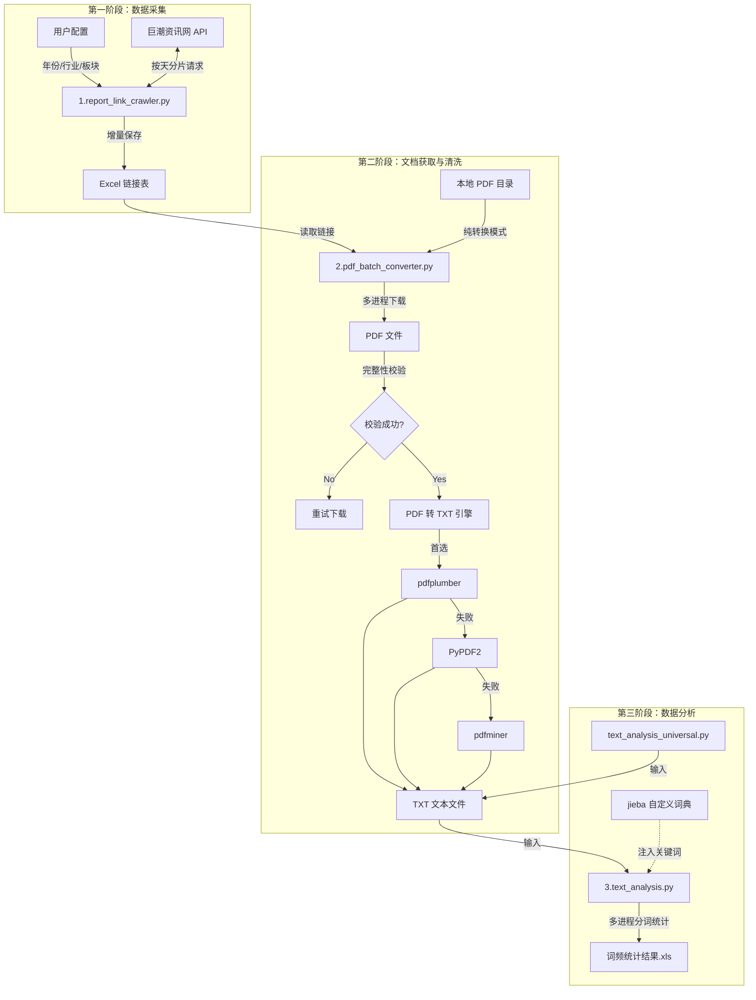

# 系统架构图 (System Architecture)

该项目采用经典的 **管道（Pipeline）架构**，数据流向清晰，分为三个独立但顺序关联的阶段：采集、处理、分析。

## 架构说明

1.  **数据采集层 (Data Collection Layer)**
    *   负责与外部数据源（巨潮资讯网）交互。
    *   核心组件：`1.report_link_crawler.py`
    *   特点：实现按天分片策略以规避 API 限制，支持断点续传（增量保存）。

2.  **数据处理层 (Data Processing Layer)**
    *   负责非结构化数据（PDF）的获取与结构化转换（TXT）。
    *   核心组件：`2.pdf_batch_converter.py`
    *   特点：包含多级转换引擎降级策略，确保最大成功率；支持多进程并发处理以提升效率。

3.  **数据分析层 (Data Analysis Layer)**
    *   负责文本挖掘与指标计算。
    *   核心组件：`3.text_analysis.py`
    *   特点：利用 NLP 技术（分词）提取特定领域关键词，生成可供量化研究的数据报表。
