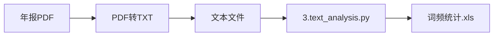
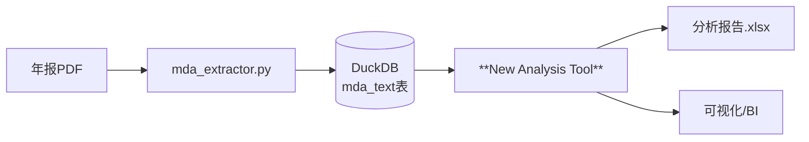

# 下游分析工具演进计划 (Straw Man Proposal)

## 1. 背景与目标

当前项目已经具备了强大的 MD&A 提取能力 (`mda_extractor.py`)，能够将非结构化的年报文本清洗并结构化存储至 DuckDB 数据库中。然而，现有的分析脚本 (`3.text_analysis.py`, `text_analysis_universal.py`) 仍然是基于文件系统（直接读取 TXT）运作的。

为了形成完整的“提取-存储-分析”数据闭环，我们需要构建下一代下游分析工具。本计划旨在提出一个基于数据库的、可扩展的分析框架设计草案。

## 2. 现有架构 vs. 目标架构

### 2.1 现有工作流 (As-Is)

*痛点：*
* 分析工具需要重新解析文件名获取元数据（股票代码、年份）。
* 无法利用 `mda_extractor.py` 清洗后的高质量 MD&A 数据（`mda_raw`）。
* 文件系统管理大量小文本文件效率低。

### 2.2 目标工作流 (To-Be)

*优势：*
* **单一事实来源**：直接消费已清洗的数据库数据。
* **元数据对齐**：自动关联股票代码、年份、行业等信息。
* **高性能**：利用数据库的批量读取和过滤能力。

## 3. 核心设计建议

### 3.1 数据接入层 (Data Access Layer)
不再遍历文件夹，而是通过 SQL 从 DuckDB 拉取数据。
*   **输入**：DuckDB 路径 (`data/annual_reports.duckdb`)
*   **过滤**：支持按年份区间 (`WHERE year BETWEEN 2020 AND 2023`)、股票代码列表进行筛选。
*   **技术选型**：`duckdb` Python 客户端 + `pandas` (用于高效的数据帧操作)。

### 3.2 分析引擎 (Analysis Engine)
保留并增强现有的分析能力，设计为插件式架构。

*   **模块 A：关键词词频 (Keyword Frequency)**
    *   *继承逻辑*：复用 `3.text_analysis.py` 中的 Jieba 分词与关键词统计逻辑。
    *   *改进*：支持动态加载词典，支持停用词过滤。
*   **模块 B：文本指标 (Text Metrics)**
    *   *新功能*：计算文本长度、可读性分数 (Readability Score)、句子平均长度等。
*   **模块 C (未来)**：情感分析 (Sentiment Analysis)、主题建模 (LDA/Topic Modeling)、相似度计算。

### 3.3 结果输出层 (Reporting Layer)
*   **Excel 导出**：从老旧的 `xlwt` (.xls) 升级为 `openpyxl` 或 `xlsxwriter` (.xlsx)，支持超过 65536 行数据。
*   **数据库回写**：将分析结果（如词频向量）写回 DuckDB 的新表（如 `analysis_keywords`），方便进行 SQL 维度的聚合分析（例如：“计算 2023 年‘人工智能’词频最高的 10 家公司”）。

## 4. 迁移路线图 (Migration Roadmap)

### 第一阶段：MVP (最小可行性产品)
*   **目标**：复刻 `3.text_analysis.py` 的功能，但数据源改为 DuckDB。
*   **功能**：
    1. 连接 DuckDB 读取 `mda_raw`。
    2. 使用多进程 (Multiprocessing) 进行分词和关键词统计。
    3. 输出 Excel 报表。
*   **交付物**：`mda_analyzer.py`

### 第二阶段：增强与集成
*   **目标**：利用结构化数据优势。
*   **功能**：
    1. 增加基于 SQL 的预筛选（只分析特定行业或板块）。
    2. 分析结果持久化存储（写回 DuckDB）。
    3. 提供简单的 CLI 命令行接口 (类似 `mda_extractor.py`)。

## 5. 示例代码片段 (Python 伪代码)

```python
import duckdb
import pandas as pd
import jieba

def load_data(db_path, year):
    conn = duckdb.connect(db_path)
    # 直接获取 DataFrame，利用 Arrow 极速传输
    return conn.sql(f"SELECT stock_code, year, mda_raw FROM mda_text WHERE year = {year}").df()

def analyze_row(row, keywords):
    text = row['mda_raw']
    # ... Jieba 分词逻辑 ...
    # return {keyword: count}
    pass

def main():
    df = load_data("data/annual_reports.duckdb", 2022)
    
    # 简单的应用逻辑，生产环境可并行化
    results = df.apply(lambda row: analyze_row(row, ["AI", "大模型"]), axis=1)
    
    # 导出
    results.to_excel("analysis_2022.xlsx")
```

## 6. 讨论点 (Open Questions)
1.  **分词性能**：由于 Jieba 是 CPU 密集型，是否需要保留 `3.text_analysis.py` 中的多进程架构？（建议：是）
2.  **全量 vs 增量**：是否需要支持增量分析（只分析数据库中新提取的记录）？
3.  **依赖管理**：是否引入 `pandas`？（建议：是，它已是数据分析的事实标准）

---
*文档生成时间：2026-01-01*